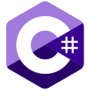

<h1>👋 Hi there, I'm </h1>

  
  

    😁<strong>About me</strong> 
    I love making my life easier by scripting the repetitive tasks and sharing my tools with the community. 
    I believe that we learn the most by tackling the issues we face in our lives.
  

  

    👨‍🎓<strong>Education</strong> 
    I studied <b>Logistics</b> (<i>2013-2018</i>) and earned a Master’s degree. 
    Later, in 2021, I completed postgraduate studies in <b>Programming in .NET</b>.
  

  

    💻<strong>Languages & Frameworks</strong> 
    &nbsp;
    &nbsp;
    &nbsp;
    &nbsp;
    &nbsp;
    &nbsp;
    &nbsp;
    &nbsp;
    &nbsp;
  

  

    🛠️<strong>Tools</strong> 
    &nbsp;
    &nbsp;
    &nbsp;
    &nbsp;
  

  

    ✨<strong>My hobbies:</strong> 🎮Gaming, 🖥️Coding, 🦖Reverse Engineering, 🤖IT Tech, 🎵Music 
    Yes, there was a time when I was making music. Some of my musical experiments can be found there:
    
  

  

    📫<strong>How to reach me:</strong>&nbsp;
    
    
  

